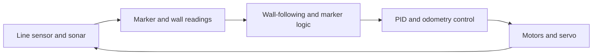
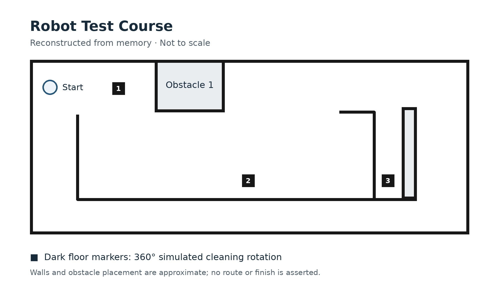

# Pololu Autonomous Maze-Navigation Robot

A two-person robotics project built around a Pololu 3pi robot for a professor-designed obstacle course. The robot followed a wall through the course, used sonar to assess nearby walls, and used its built-in line sensor to detect dark floor markers. At a marker, it stopped and performed a 360-degree rotation to simulate cleaning.

## Project objective

Navigate an obstacle course containing walls, dead ends, and three dark floor markers. The assignment called for a cleaning-style rotation at each marker and exploration of possible routes through the map.

The demo video shows the robot navigating the course and completing two rotations on dark markers. It does not demonstrate all three rotations or a complete mapping/search strategy.

## Hardware and software

- Pololu 3pi robot (exact model not confirmed)
- Arduino C++ firmware
- Built-in line sensor for dark floor-marker detection
- Sonar distance sensor mounted on a servo for directional scanning
- Wheel encoders and odometry for position tracking and turn control
- Battery power; serial connection used for monitoring

## How it worked

The final behavior used left-wall following to traverse the maze. At intervals, the servo aimed the sonar toward the front and right to measure wall distances. The serial monitor displayed the measured distances to the left and right walls during testing.

The line sensor detected a dark floor marker. The robot continued briefly to position itself near the center of the marker, stopped, and turned 360 degrees to simulate cleaning. The demo video visibly confirms two such rotations.

PID control helped keep the robot moving straight. Odometry supported position tracking and more precise turns. The sonar mount was adapted to the Pololu robot so the servo could move the sensor and scan in different directions.

## Testing and experiments

The team combined earlier lab exercises to learn the robot's individual components, then integrated and tested the parts needed for the course. We evaluated wall-following values, dark-marker detection, and how often the servo should scan. The robot ran on batteries while a serial connection was used to monitor readings.

We also tried route-selection ideas, including a left-first approach and a furthest-search approach. These were experiments, not part of the final navigation behavior: they needed more tuning, and the left-first approach was slower in our tests.

## Limitations and lessons

At a dead end, the robot could turn around and retrace its route. However, sonar readings could indicate greater clearance when the robot was off-center, which sometimes caused it to get stuck. We did not complete persistent mapping or route memory, so it could not reliably remember which branch to take after returning from a dead end. A planned approach was to map more of the course and switch to following the right wall after returning, but that behavior was not completed.

This project taught us to validate sensor thresholds and motor behavior on the physical robot, and to distinguish a working reactive behavior from a search strategy that still needs tuning.

## Team contributions

This was a two-person project. I integrated earlier lab work, programmed the robot's behavior and rules, adapted the servo-mounted sonar setup, and participated in testing and tuning. My teammate recorded the video, organized the project files into a ZIP deliverable, and worked with me on troubleshooting, testing, and evaluating wall-following values, marker detection, and servo scan timing.

## Demo

The demo shows the robot navigating the course and completing two cleaning-style rotations on dark floor markers. The robot runs on batteries; the attached cable is used for serial monitoring.

[Watch the robot demo](media/robot-course-demo.mov)

## Course map

The course map was reconstructed from memory and is not to scale.

